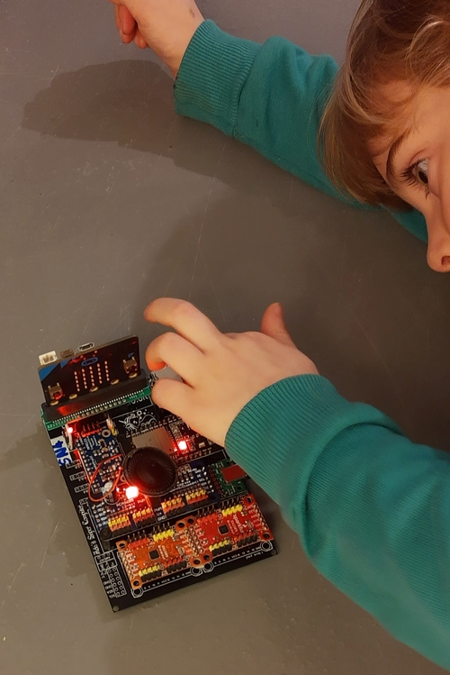

Open this page at [https://targetarchitecture.github.io/Rainbow-Sparkle-Unicorn/](https://targetarchitecture.github.io/Rainbow-Sparkle-Unicorn/)

My first BBC Microbit PXT Makecode extension to drive Ada's project board, affectionately called "Rainbow Sparkle Unicorn"

## Use as Extension

This repository can be added as an **extension** in MakeCode.

* open [https://makecode.microbit.org/](https://makecode.microbit.org/)
* click on **New Project**
* click on **Extensions** under the gearwheel menu
* search for **https://github.com/targetarchitecture/Rainbow-Sparkle-Unicorn** and import

## Edit this project 

To edit this repository in MakeCode.

* open [https://makecode.microbit.org/](https://makecode.microbit.org/)
* click on **Import** then click on **Import URL**
* paste **https://github.com/targetarchitecture/Rainbow-Sparkle-Unicorn** and click import

## Blocks preview

This image shows the blocks code from the last commit in master.
This image may take a few minutes to refresh.

#### Metadata (used for search, rendering)

* for PXT/microbit

